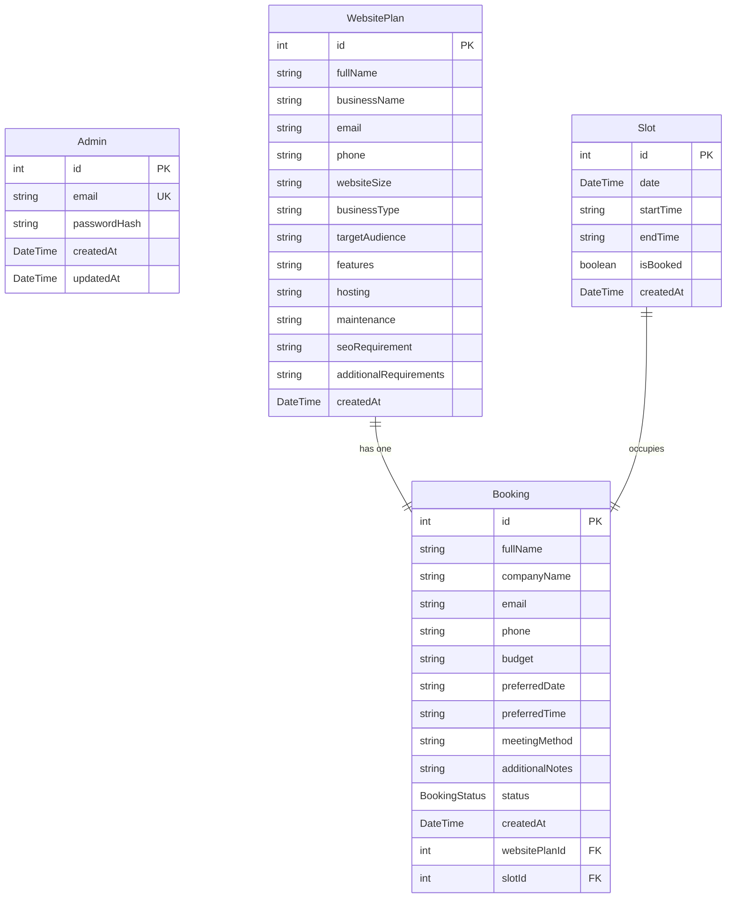
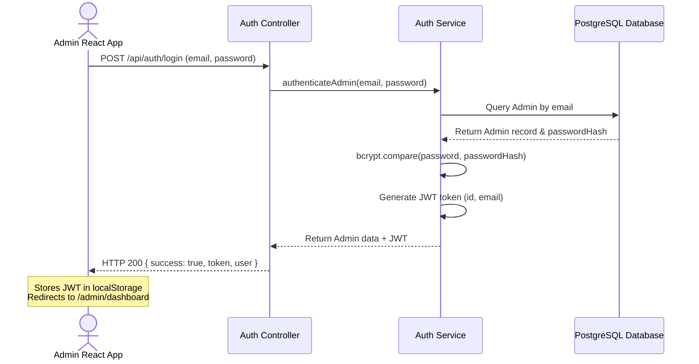
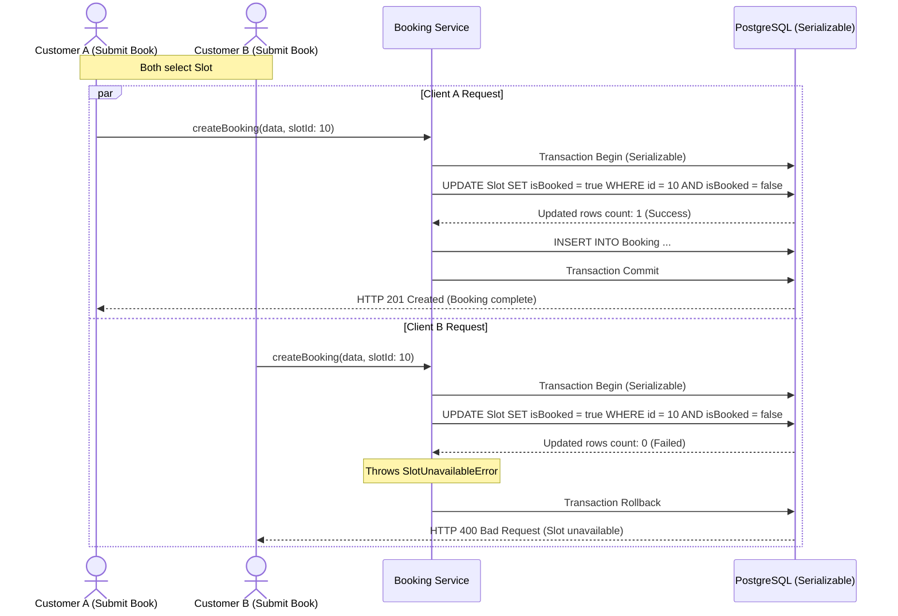
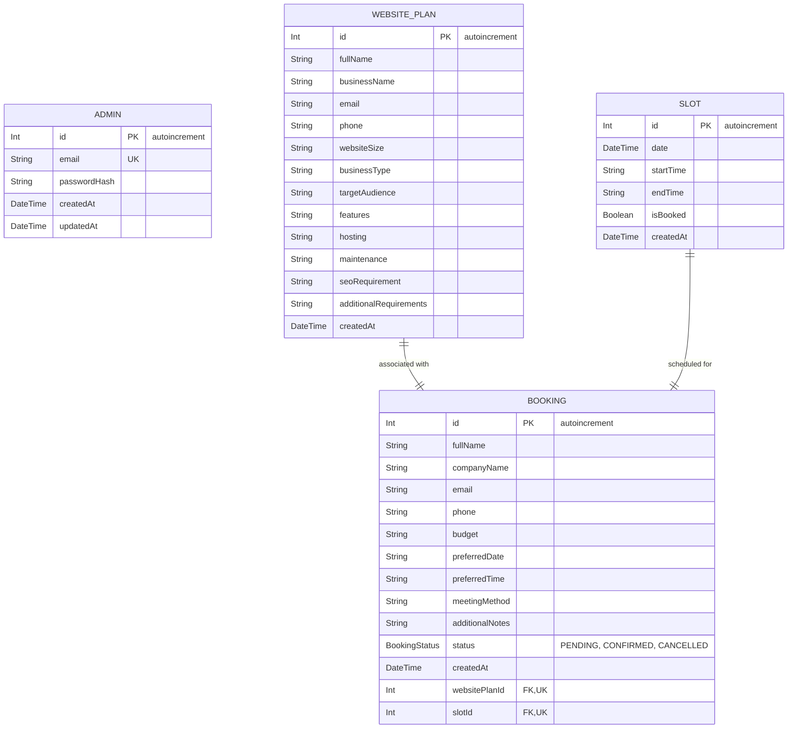

# Customer Web Builds - Complete Project Documentation & Learning Guide

Welcome to the **Customer Web Builds** Reference Manual. This document is a comprehensive guide to understanding every internal behavior, module, API, database model, and user flow of the application. Whether you are revisiting the project months later, preparing for technical interviews, or looking to extend the system, this guide provides all the necessary depth.

---

## 1. Project Overview

### Purpose of the Application
**Customer Web Builds** is a specialized B2B booking and custom-tailored web development service application. It bridges the gap between potential business clients looking to build custom websites and web design/development agencies. The application enables clients to specify their custom website requirements, estimate/select plans, check developer slot availability in real time, and book synchronous discovery call meetings to kick off projects.

### Problem Statement
Agencies often waste resources on prolonged asynchronous email exchanges to gather basic website requirements, budgets, size, and scheduling preferences. Additionally, clients struggle to conceptualize what package size fits their needs (e.g., standard e-commerce, small business clinic, custom web application) and fail to lock in discovery calls efficiently.

### Objectives
1. **Automated Website Planning**: Provide an intuitive form wizard where clients specify website size, business vertical, features (SEO, Hosting, Maintenance, etc.) and generate a clear structured plan.
2. **Real-time Slot Booking**: Eliminate scheduling back-and-forth by letting clients choose live available appointment slots stored in a relational database.
3. **Transaction Safety**: Prevent double-booking using transactional safety guarantees on slot selections.
4. **Immediate Communication**: Automatically dispatch professional HTML email notifications to both the customer (confirmation, status changes) and the admin (new lead/booking notifications) via SMTP/Nodemailer.
5. **Robust Administration**: Empower admins to view leads, manage website plans, confirm or cancel bookings, manage developer slots, and analyze statistics.

### Users
- **Customers / Business Clients**: Users visiting the homepage to browse features, templates, testimonials, customize their desired website plan, and book a discovery call.
- **Admin (Agencies / Developers)**: Authenticated managers who log in to review customer website specifications, adjust bookings, manage calendar availability, and oversee operations.

### Features
- **Responsive Modern Landing Page**: Showcases templates, active client reviews, and transparent pricing.
- **Multi-Step Website Planner**: Dynamically captures features, hosting/maintenance needs, target audience, and generates structured plans.
- **Interactive Calendar Slot Selector**: Retrieves available slots for the preferred date and matches them to developer availability.
- **Robust Status Tracking**: Real-time status retrieval for booked slots (Pending, Confirmed, Cancelled).
- **Admin Dashboard**: Complete metrics (total bookings, pending count, confirmation rate), tabular reports of website plans, full slot control (create slots, toggle availability), and profiles.

### Complete Project Workflow
```
[Customer visits Landing Page]
       │
       ▼
[Plan Website Page] ──► Fills website specifications ──► Saves WebsitePlan JSON to DB
       │
       ▼
[Booking Page] ───────► Views available slots ──► Chooses Slot & Fills details ──► Transactional booking commits
       │
       ▼
[Transaction Success] ─► Slot marked booked ──► Email sent to Customer & Admin ──► Thank You Screen
       │
       ▼
[Admin Dashboard] ────► Admin logs in ──► Reviews booking details ──► Confirms/Cancels ──► Email updates sent
```

---

## 2. Overall Architecture

The application is built on a decoupled Client-Server architecture utilizing a modern React Single Page Application (SPA) frontend, an Express (TypeScript) REST API backend, and a PostgreSQL database mapped via Prisma ORM.

### System Stack Integration

```
         ┌─────────────────────────────────────────────────────────────┐
         │                          FRONTEND                           │
         │  [React Client] ◄──► [React Router] ◄──► [Auth Context]     │
         └──────────────┬───────────────────────────────▲──────────────┘
                        │ (HTTPS Requests)              │ (JSON Responses)
                        ▼                               │
         ┌──────────────────────────────────────────────┴──────────────┐
         │                          BACKEND                            │
         │  [Express Server]                                           │
         │     ├── [Router] (auth.routes, booking.routes, etc.)        │
         │     ├── [Middleware] (authMiddleware, errorHandler)        │
         │     ├── [Controller] (Validates using Zod, calls Service)   │
         │     └── [Service] (Business logic, prisma transactions)     │
         └──────────────┬───────────────────────────────▲──────────────┘
                        │ (ORM Queries)                 │ (Data Records)
                        ▼                               │
         ┌──────────────────────────────────────────────┴──────────────┐
         │                          DATABASE                           │
         │  [Prisma Client] ◄─────────────────────────► [PostgreSQL]   │
         └─────────────────────────────────────────────────────────────┘
```

### Component Execution Flow & The Request Pipeline
```
React ──► Axios ──► Express ──► Controllers ──► Services ──► Prisma ──► PostgreSQL
```

#### Detailed Breakdown of Every Transition:
1. **React $\rightarrow$ Axios**: A component triggers a function (e.g. `submitBooking`). It calls a pre-configured Axios client method (e.g. `api.post('/bookings', data)`) encapsulating headers, base URL, and payloads.
2. **Axios $\rightarrow$ Express**: The HTTP client (Axios) serializes the request into JSON and sends it over TCP/IP to the configured Express port. Express accepts it, parses JSON via `express.json()` middleware, and matches the endpoint route (e.g., `/api/bookings`).
3. **Express $\rightarrow$ Controllers**: The Express router executes route handlers mapped to a controller method. The controller's job is parsing HTTP metadata (headers, parameters, request body), invoking validations (Zod schemas), and forwarding safe parameters.
4. **Controllers $\rightarrow$ Services**: The controller invokes an asynchronous service function. The Service layer contains the core business logic (e.g. verifying database transactions, calculating stats, calling email templates) decoupled from HTTP request/response concepts.
5. **Services $\rightarrow$ Prisma**: The service invokes methods on the autogenerated `prisma` client wrapper (e.g. `prisma.booking.create()`).
6. **Prisma $\rightarrow$ PostgreSQL**: Prisma converts the object-relational query builder structure into native parameterized PostgreSQL queries (e.g., `INSERT INTO "Booking" ...`), opens a database transaction over the pool connection, executes the queries, and returns raw result records mapping them back to TypeScript types.

---

## 3. Folder Structure

### Root Workspace Layout

```
customer-web-builds/
├── backend/                       # Server-side Application code
│   ├── prisma/                    # Prisma configuration & migrations
│   │   ├── migrations/            # Generated PostgreSQL SQL files
│   │   ├── schema.prisma          # Database models definitions
│   │   └── seedAdmin.ts           # Admin seeder script
│   └── src/                       # Backend Source code
│       ├── app.ts                 # Express Application Setup
│       ├── server.ts              # Server Entrypoint
│       ├── config/                # Mailer & Env configuration
│       ├── controllers/           # HTTP Request Controllers
│       ├── lib/                   # Shared Prisma client wrapper
│       ├── middleware/            # Auth, Error handling & Not Found middlewares
│       ├── routes/                # Endpoint router definitions
│       ├── services/              # Core business services
│       ├── templates/             # Nodemailer HTML email templates
│       ├── types/                 # Express & Custom TypeScript models
│       ├── utils/                 # Response helpers, seed scripts
│       └── validations/           # Zod payload validation schemas
└── src/                           # Frontend Source code
    ├── App.tsx                    # React App routing tree root
    ├── main.tsx                   # React Browser rendering entrypoint
    ├── api/                       # Axios Client Instance
    ├── components/                # Modular UI elements
    ├── context/                   # Auth Context & Local storage state
    ├── data/                      # Hardcoded configuration (portfolio projects, templates)
    ├── layouts/                   # Shared page wrappers (Main, Admin layouts)
    ├── pages/                     # Routed view screens
    ├── routes/                    # Router registration
    ├── services/                  # Frontend API service callers
    ├── styles/                    # Global CSS variables & layout resets
    ├── types/                     # Shared Frontend TypeScript definitions
    └── utils/                     # Formatting utilities
```

### Purpose & Dependency Matrix of Key Files

#### 1. Backend Config Files
*   `backend/src/config/env.ts`
    *   **Purpose**: Validates and exports parsed environment variables (SMTP, JWT, PORT, Database credentials).
    *   **Dependency**: Imported by `mailer.ts`, services, and middleware.
*   `backend/src/config/mailer.ts`
    *   **Purpose**: Configures a reusable Nodemailer `Transporter` instance using environment SMTP variables.
    *   **Dependency**: Imported by `email.service.ts` to perform mail dispatch.

#### 2. Backend Prisma Client
*   `backend/src/lib/prisma.ts`
    *   **Purpose**: Exports a single singleton instance of `PrismaClient` to prevent database connection exhaustion in hot-reloading dev environments.
    *   **Dependency**: Imported by all Backend Services.

#### 3. Frontend Axios Instance
*   `src/api/api.ts`
    *   **Purpose**: Instantiates Axios with base URL `/api`, appends Authorization JWT token from `localStorage` in request headers.
    *   **Dependency**: Used by all Frontend Services (`auth.service`, `booking.service`, etc.).

---

## 4. Frontend Explanation

### Routing Map & Layout Strategy

#### Routes Definition (`src/routes/AppRoutes.tsx`)
Configures all React routes using `react-router-dom`:
- **MainLayout Wrappers**: Contains navigation header and footer.
  - `/` $\rightarrow$ `Home`: Shows main marketing/intro widgets.
  - `/plan` $\rightarrow$ `PlanWebsite`: The Multi-step Wizard page.
  - `/book` $\rightarrow$ `Booking`: Slot Selection & Lead details.
  - `/thank-you` $\rightarrow$ `ThankYou`: Completion screen.
  - `*` $\rightarrow$ `NotFound`: Custom 404 page.
- **AdminLayout & Private Routes**: Protected by `<ProtectedRoute>` context guard.
  - `/admin/login` $\rightarrow$ `Login`: Entry point for admin login (exempt from private guard).
  - `/admin/dashboard` $\rightarrow$ `AdminDashboard`: Statistics and key metrics cards.
  - `/admin/bookings` $\rightarrow$ `Bookings`: Reviewing leads table and updating status.
  - `/admin/website-plans` $\rightarrow$ `WebsitePlans`: Detailed requirements view.
  - `/admin/slots` $\rightarrow$ `Slots`: Generate new calendar dates and edit slot status.
  - `/admin/profile` $\rightarrow$ `Profile`: Admin password update controls.

---

### Key Page Modules Details

#### 1. Page: Home (`src/pages/Home/Home.tsx`)
*   **Purpose**: Combines multiple landing sections to convince the user of the agency's quality and push them to start planning.
*   **UI Components**:
    *   `Hero`: Splash header with CTA button directing to `/plan`.
    *   `WhyChooseUs`: Displays unique value propositions.
    *   `WebsiteFeatures`: Shows customizable tech list.
    *   `PricingPreview`: Features pricing cards matching pricing plans data.
    *   `PortfolioPreview`: Displays previous mock projects built.
    *   `TemplatesGallery`: Shows templates gallery.
    *   `TestimonialsSection`: Client recommendations.
    *   `CTA`: Bottom call-to-action button linking directly to planner.

#### 2. Page: Website Planner (`src/pages/PlanWebsite/PlanWebsite.tsx`)
*   **Purpose**: Walk the user through structural questions to define a project scope.
*   **Internal logic**: Uses local component state `step` (1 to 3) to render active panels.
    *   *Step 1*: Personal Info (Name, Business, Email, Phone).
    *   *Step 2*: Website Basics (Website Size: One-page, Small, E-commerce, custom; Business Type).
    *   *Step 3*: Advanced Specifications (SEO options, Hosting package, Maintenance retainer, custom features description).
*   **Data flow**: On final step click, validates inputs, makes API call to `websitePlanService.create()`, receives the created `WebsitePlan` model, stores `websitePlanId` in browser `sessionStorage`, and pushes navigation history to `/book`.

#### 3. Page: Booking Calendar (`src/pages/Booking/Booking.tsx`)
*   **Purpose**: Connects client details and selects an available appointment slot.
*   **Internal logic**:
    *   Retrieves all available slots using `slotService.getAvailableSlots()`.
    *   Groups slot times by date.
    *   Provides a date picker; selecting a date filters and displays matching time slot pill components.
    *   Allows selection of one slot.
    *   Form handles details: Full Name, Company, Email, Phone, Budget, Meeting Method (Google Meet, Phone Call, Zoom), and Additional Notes.
*   **Data flow**: Submits payload to `bookingService.createBooking()`. Upon success, clears `sessionStorage` and navigates to `/thank-you?bookingId={id}`.

---

## 5. Backend Explanation

### Controller & Validation Architecture

Every controller uses the `asyncHandler` utility to capture unresolved Promise errors and pipe them cleanly into the global Express Error Handler middleware. Payload validation is verified using **Zod** models before service functions are invoked.

#### 1. Booking Controller (`booking.controller.ts`)
*   **`createBookingController`**:
    *   Parses and validates payload using Zod `bookingSchema`.
    *   Calls `createBooking(body)` service, executing a serializable PostgreSQL transaction.
    *   Dispatches background asynchronous operations: `sendConfirmationEmail` and `sendAdminNotificationEmail`.
    *   Returns HTTP `201 Created` status with booking details.
*   **`getBookingStatusController`**:
    *   Extracts dynamic URL parameter `id`.
    *   Queries `getBookingStatus(id)`. Returns JSON `status` (PENDING, CONFIRMED, CANCELLED) or `404 Not Found` if missing.
*   **`updateBookingStatusController`**:
    *   Validates new status using Zod `updateBookingStatusSchema`.
    *   Calls `updateBookingStatus(id, status)` service.
    *   Triggers status-updated emails (if CONFIRMED or CANCELLED) to client. Returns modified record.

#### 2. Slot Controller (`slot.controller.ts`)
*   **`getAvailableSlotsController`**:
    *   Queries database for slots where `isBooked: false` and the slot date is today or later.
    *   Returns array of available dates and hours.

---

## 6. Database Schema & Relational Design

The database schema is managed via Prisma ORM and maps to standard PostgreSQL tables:



### Models & Field Definitions

1.  **Booking**:
    *   `id`: Primary auto-incrementing integer key.
    *   `websitePlanId`: Foreign Key linking to `WebsitePlan.id`. Defined with a `@unique` constraint. Choosing a 1-to-1 (`||--||`) mapping ensures that a client's specific design planning form is only linked to a single discovery call.
    *   `slotId`: Foreign Key linking to `Slot.id`. Defined with a `@unique` constraint. This prevents different bookings from referencing the same physical slot record.
    *   `status`: Mapped to Enum `BookingStatus` (`PENDING`, `CONFIRMED`, `CANCELLED`).
2.  **Slot**:
    *   `date`: Represented as `DateTime`.
    *   `startTime` / `endTime`: String variables denoting start and end (e.g. `"10:00"`, `"11:00"`).
    *   `@@unique([date, startTime])`: Compound unique index preventing overlapping slot configurations on the same date/time.

---

## 7. API Documentation

### 1. Website Plan Creation
- **Endpoint**: `POST /api/website-plan`
- **Controller**: `createWebsitePlanController`
- **Request Body**:
```json
{
  "fullName": "Alice Smith",
  "businessName": "TechCorp",
  "email": "alice@techcorp.com",
  "phone": "+919876543210",
  "websiteSize": "E-commerce Website",
  "businessType": "Retail",
  "targetAudience": "General Consumer",
  "features": "Online Payment, Shopping Cart",
  "hosting": "Standard Cloud Hosting",
  "maintenance": "Basic Maintenance Service",
  "seoRequirement": "Basic SEO Setup",
  "additionalRequirements": "None"
}
```
- **Response** (`201 Created`):
```json
{
  "success": true,
  "data": {
    "id": 42,
    "fullName": "Alice Smith",
    "businessName": "TechCorp",
    "email": "alice@techcorp.com",
    "phone": "+919876543210",
    "websiteSize": "E-commerce Website",
    "businessType": "Retail",
    "createdAt": "2026-07-22T05:10:00.000Z"
  }
}
```

### 2. Create Booking (discovery call transaction)
- **Endpoint**: `POST /api/bookings`
- **Controller**: `createBookingController`
- **Request Body**:
```json
{
  "websitePlanId": 42,
  "fullName": "Alice Smith",
  "companyName": "TechCorp",
  "email": "alice@techcorp.com",
  "phone": "+919876543210",
  "budget": "₹50,000 - ₹1,00,000",
  "meetingMethod": "Google Meet",
  "additionalNotes": "Looking forward to talking",
  "slotId": 14
}
```
- **Response** (`201 Created`):
```json
{
  "success": true,
  "message": "Booking Created Successfully",
  "data": {
    "id": 18,
    "fullName": "Alice Smith",
    "companyName": "TechCorp",
    "email": "alice@techcorp.com",
    "phone": "+919876543210",
    "budget": "₹50,000 - ₹1,00,000",
    "preferredDate": "2026-07-25T00:00:00.000Z",
    "preferredTime": "11:00 AM",
    "meetingMethod": "Google Meet",
    "additionalNotes": "Looking forward to talking",
    "status": "PENDING",
    "createdAt": "2026-07-22T05:12:00.000Z",
    "websitePlanId": 42,
    "slotId": 14
  }
}
```

---

## 8. Authentication & Authorization

Admin authentication uses stateless **JSON Web Tokens (JWT)** and secure hashing:

```
                  [ Admin Password Input ]
                             │
                             ▼
                 [ compares bcrypt hash ]
                             │
            ┌────────────────┴────────────────┐
            ▼ (Matched)                       ▼ (Failed)
     [ Generate JWT ]                   [ return 401 Error ]
            │
            ▼
[ Client stores in localStorage ]
            │
            ▼
[ AuthContext updates user state ]
```

- **Password Hashing**: Uses `bcrypt` hashing on the seeder script to store passwords securely.
- **Token Generation**: Generates a JWT signed with `JWT_SECRET`, encoding `{ id: admin.id, email: admin.email }` which expires within `24h`.
- **Token Verification (Middleware)**:
  `auth.middleware.ts` intercepts requests matching admin endpoints. It checks the header:
  `Authorization: Bearer <token>`.
  Decodes and verifies signature; on success, binds `req.admin = payload` and calls `next()`. On failure, returns `401 Unauthorized`.

---

## 9. Email System

Nodemailer handles the communication layer.

- **SMTP Verification**: During server boot, the system runs `verifySmtpConnection()` testing credentials and printing server configuration status in the logs.
- **Confirmation Email**: Triggered immediately upon new booking creation (`PENDING` state) and upon subsequent state changes to `CONFIRMED` or `CANCELLED`.
- **Admin Notification**: Dispatched on a separate route thread when a booking completes successfully, compiling the associated `WebsitePlan` options dynamically for the admin's convenience.
- **Failures Isolation**: Wrapped inside individual `try/catch` statements within the controller lifecycle. In case of SMTP timeouts, network blocks, or invalid addresses, the controller logs the incident to `stderr` but does not disrupt the client's HTTP response.

---

## 10. The Booking Transaction Lifecycle

```
[Booking Page Form Submit]
            │
            ▼
[POST Request to /api/bookings]
            │
            ▼
[Controller parses & validates via Zod schema]
            │
            ▼
[Service starts Serializable Prisma Transaction]
            │
            ├─► 1. Tries to update slot status where ID matches and isBooked is FALSE
            │      └─► Row modified?
            │            ├─► YES: Slot reserved successfully. Proceed.
            │            └─► NO: Throws SlotUnavailableError (Slot already booked).
            │
            ├─► 2. Creates the Booking table record linking slotId and websitePlanId.
            │
            ▼ (Commit Transaction)
[Return 201 Response to React Client]
            │
            ▼ (Background tasks fire asynchronously)
[Sends Customer Confirmation Email & Admin Notification Email]
```

---

## 11. Sequence Diagrams

### 1. Authentication Login Workflow


### 2. Double-Booking Prevention Transaction Flow


---

## 12. Database ER Diagram

Detailed database tables relational map:



---

## 13. Summary Reference Checklist for Quick Operations

| Feature | HTTP Endpoint | Payload Validation | Affected DB Tables | Triggers Email? |
| :--- | :--- | :--- | :--- | :--- |
| **Plan Website** | `POST /api/website-plan` | `websitePlanSchema` | `WebsitePlan` | No |
| **Submit Booking** | `POST /api/bookings` | `bookingSchema` | `Booking` & `Slot` (updated) | Yes (Customer & Admin) |
| **Fetch Free Slots** | `GET /api/slots/available` | None | `Slot` (read) | No |
| **Admin Login** | `POST /api/auth/login` | `loginSchema` | `Admin` (read) | No |
| **Manage Status** | `PATCH /api/bookings/:id/status`| `updateBookingStatusSchema`| `Booking` (status updated)| Yes (Customer Update) |
| **Create Custom Slots**| `POST /api/slots/bulk` | Zod validation | `Slot` (multi-insert) | No |
